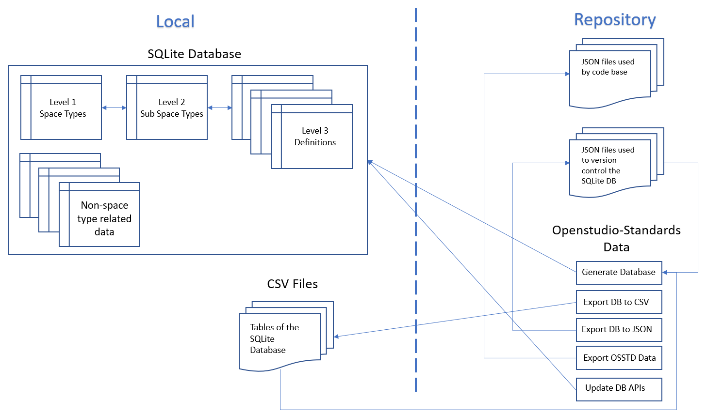
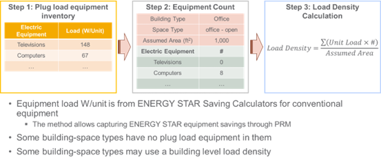

# OpenStudio-Standards Data
This folder contains the code that manages the data needed by OpenStudio-Standards to operate. The data is managed through an SQLite database. The database is not hosted on the repository but can be easily and quickly created with a few lines of code (see [Quick Start Guide](#quick-start-guide)). The database is managed by code located in the `./database_engine` and `./database_tables` folders. Data used to populate the database tables is located in `./database_files`. Pre-constructed queries and code for other types of applications for the database is located in `./query` and in `./applications`. Some tests to ensure, among others, that the database can be successfully created are located in `./test`.

## Motivation
Using a relational database makes the data management process seamless as the database maintains relationships among the different data tables and performs automatic data validation. Data fed to the database is currently stored in JSON files. This enables version control of the content of the database. As the format of these JSON files is currently different than the one needed by OpenStudio-Standards, functions have been built to automate the export of the data to the required format (see [Quick Start Guide](#quick-start-guide)).
## Prerequisites
Below are listed the prerequisites to any of the database related code.
- Python 3.10
## Database Structure and Covered Data
### Structure
The figure below shows an overview of the structure of the database and of the data management approach.

### Covered Data
As shown in the figure above, the database contains two types of data: space type data and non-space type related data. The space type related data is made of three distinct but interconnected levels.

- The first level, level 1, corresponds to a single data table that contains a list of space type names supported by OpenStudio-Standards and a mapping to different sub-space type names (such as lighting, ventilation, and equipment, etc.) that can be used to determine general modeling assumption for a space type for a specific building energy code version.
- The second level, level 2, is a collection of data tables that contains lists of sub-space type names and references to different code requirement values.
- The third and final level, level 3, is a collection of data tables that contains raw information from building energy codes, such as lighting power allowances and required ventilation rates.
The list of space type provided in the level 1 table is a concise yet exhaustive list of space type that can be used to model most commercial building spaces. Assumptions for these space types are contained in the level 2 and level 3 tables, however these tables contain additional information about more specific space type requirements (or less specific, e.g., through the building area method lighting power allowances).

This approach lends itself to customization, for example, the mapping of a particular space type name to sub-space type can be overwritten by changing the reference to the sub-space types (level 2) in the level 1 table. Another possible use of the database is to only access the level 3 data tables to get a direct access to the raw code information in a tabulated format which, again, contains more data than what is used to derive the modeling assumptions for the space types listed in the level 1 table.

The non-space type related data, contains all other data needed by OpenStudio-Standards, this includes constructions/materials tables, performance curves tables, minimum code required HVAC efficiency, system requirements, etc.

## Space Type Data
### Space Type Names
The space type names list has been created using engineering judgment and the space type name list from the ASHRAE Standard 90.1 lighting building area and space-by-space tables. Space type names were either concatenated or simplified to be self-descriptive.
### Lighting
Lighting assumptions for each space type comes from actual building energy code requirements. As the space type names referenced in each version of ASHRAE Standard 90.1 changes from one version to another, a mapping effort was conducted to reconcile the requirements for each space type for all versions of the code.
### People density and Ventilation
The people density and ventilation data originate from values specified in ASHRAE Standard 62.1. Similarly to the lighting data, a mapping effort was conducted to reconcile the requirements for each space type for all versions of the code. While OpenStudio-Standards currently offers data for the 2004 version of 90.1 up to the 2019 version of 90.1, ventilation/people density values for some space type could not be found for all versions of 62.1. In this instance, if available, older values were used, all the way to 62.1-1999 when needed.
### Equipment
The equipment assumptions are based on a plug-load values derived from a project led at the Pacific Northwest National Laboratory (PNNL) named *Development of Building-Space-Specific Loads for Performance Rating Methods*. Plug-load for each space type were determined using a bottom-up approach, see the figure below. Minimum, maximum, average, and median equipment power density values are provided (average values are currently used when exporting the data to the JSON files used by OpenStudio-Standards).


### Schedules
The schedules used in the database were determined based on the PNNL led *Development of Building-Space-Specific Loads for Performance Rating Methods* project. The schedules were derived from the [SBEM-NCN database](https://www.ncm-pcdb.org.uk/sap/page.jsp?id=7), modifications were applied to make them perceived as more realistic such as reducing the occupancy fraction during the day (as space is very rarely fully occupied), or leave a very small fraction of the lights on at night.
## Quick Start Guide
### Create the Database
```python
import sqlite3
from applications.database_maintenance import create_openstudio_standards_database_from_json

conn = sqlite3.connect('openstudio_standards.db')
create_openstudio_standards_database_from_json(conn)
conn.close()
```

This code will generate an `openstudio_standards_database.sql` file in the same file directory. The database can be opened using a software such as [DB Browser for SQLite](https://sqlitebrowser.org/).
### Export the Database Data
```python
from applications.database_maintenance import export_openstudio_standards_database_to_json
conn = sqlite3.connect('openstudio_standards.db')
export_openstudio_standards_database_to_json(conn, save_dir='./database_files/')
```
Assuming that `openstudio_standards.db` is a valid SQLite database name, the code above will export the content of the database tables to JSON files located in `./database_files/`. Because data tables are typically easier to read, parse, and modify in a spreadsheet format, the data tables can also be exported to CSV files. The code block below shows an example of how one can do so.
```python
from applications.database_maintenance import export_openstudio_standards_database_to_csv
conn = sqlite3.connect('openstudio_standards.db')
export_openstudio_standards_database_to_csv(conn, save_dir='./database_files/')
```
### Modifying the Database
The database data can be updated by modifying the JSON files directly, or the exported CSV files and then be regenerated using the following code block.
```python
import sqlite3
from applications.database_maintenance import create_openstudio_standards_database_from_csv

conn = sqlite3.connect('openstudio_standards.db')
create_openstudio_standards_database_from_csv(conn)
conn.close()
```
New tables can be added to the database, but they have to first be defined programmatically first. A new file should be created in `./database_tables`. Each file defines the "schema" of a table and how it relates to other tables. The content of the new file can be adapted from an existing file. A JSON or CSV file containing the initial data to populate the database should be added to `./database_files` and added to the `__init__.py` file located in `./database_tables`.

### Logging
Logs can be generated when running some of the previously mentioned code by using the following lines first.
```python
import logging
logging.getLogger().setLevel(logging.INFO)
```
### Generate OpenStudio-Standards Data
The following code block can be used to generate the non-space type related data needed by Openstudio-Standards to operate for several versions of ASHRAE Standard 90.1. The function will export the JSON files in the right directory.
```python
import sqlite3
conn = sqlite3.connect('openstudio_standards.db')
from applications.create_openstudio_standards_json import create_openstudio_standards_data_json_ashrae_90_1
for t in ["2004", "2007", "2010", "2013", "2016", "2019"]:
    create_openstudio_standards_data_json_ashrae_90_1(conn=conn, version_90_1=t)
conn.close()
```
The following code block can be used to generate the space type related data needed by Openstudio-Standards to operate for several versions of ASHRAE Standard 90.1. The function will export the JSON files in the right directory.
```python
import sqlite3
conn = sqlite3.connect('openstudio_standards.db')
from applications.create_openstudio_standards_json import create_openstudio_standards_space_data_json_ashrae_90_1
for t in ["2004", "2007", "2010", "2013", "2016", "2019"]:
    create_openstudio_standards_space_data_json_ashrae_90_1(conn=conn, version_90_1=t)
conn.close()
```
## Future Enhancements
- Add input validation to the functions used to generate/export the database and the OpenStudio-Standards data
- Add a command line interface to perform the generation/export/modification
- Add data for additional code versions
- Support queries to the database to avoid having to store two sets of JSON data files when running OpenStudio-Standards
- Move database to a different repository; Updates to the OpenStudio-Standards data would be made through automated PRs every time updates would be made to the data repository
## Contribute
### Code Formatting
Consistent code formatting is enforced by using the [Black Python code formatter](https://github.com/psf/black). Tests are run to make sure that any changes to the code is consistent with Black's formatting standards. Before creating a pull request and after installing Black, run `black -l 88 ./` to format all Python files within this directory.
### Tests
A small set of tests have been implemented, mostly to make sure that further edits to the data or database structure is valid, and that JSON and CSV files generated from the database include the same content. Tests are run using a GitHub action, see the workflow YAML file in `../../.github/workflow/openstudio_standards_database.yml`.
