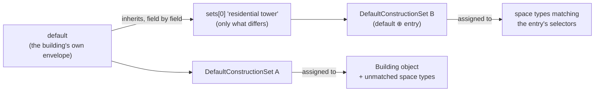

# Custom Building Types

openstudio-standards can create a complete typical model of a **custom building type**: a named mix of space types with custom area ratios, building form, schedule overrides, and internal load overrides. The space type mix comes in one of two forms:

- **standard (donor) space types** — `BuildingType | SpaceType` pairs from the standards data for the template, which borrow loads, schedules, ventilation, and service water heating from the standard data
- **typical space types** — building-type-agnostic space types from `lib/openstudio-standards/space_type/data/all_level_space_types.json` (e.g. `office`, `classroom/lecture/training`, and building-type-qualified variants such as `corridor - primary school`), which build loads from the typical lighting, equipment, and ventilation data

## Concept: donor space types

Every space type in a model carries a `standardsBuildingType` and `standardsSpaceType` pair. That pair is the lookup key for all standards data (internal loads, parametric schedule sets, ventilation, exhaust, service water heating, thermostats). A custom building keeps those keys pointing at *standard* building/space types so all data lookups keep working, and expresses its customization through:

- **custom area ratios** — any mix of `BuildingType | SpaceType` pairs, across building types
- **building form** — floor area, stories, aspect ratio, window-to-wall ratio, story heights
- **schedule overrides** — parametric schedule parameters (base, peak, ...) per space use
- **load overrides** — occupant density, lighting/equipment power density, ventilation rates
- **a name** — a label on the Building object that does not affect any lookup

## Concept: typical space types

Alternatively, the mix can be built directly from the **typical space types** in `lib/openstudio-standards/space_type/data/all_level_space_types.json` by omitting `building_type` from every ratio entry:

```jsonc
"space_type_ratios": [
  { "space_type": "office", "ratio": 0.7, "default": true },
  { "space_type": "corridor", "ratio": 0.2, "circ": true },
  { "space_type": "restroom", "ratio": 0.1 }
]
```

These are the same space type names that `schedule_overrides` and `load_overrides` match on, so one vocabulary describes the whole spec. The generated space types carry the typical name as their `standardsSpaceType` and no standards building type of their own (the OpenStudio SDK reports the Building-level standards building type — the `primary_building_type` — by inheritance), and `create_typical_building_from_model` runs with `space_type_load_method: 'typical'`, which bypasses the standards space type load lookups and instead builds:

- **occupancy** from the Occupancy module data (`lib/openstudio-standards/occupancy/data/typical_space_type_occupancy.json`), looked up by the space type's ventilation space type and the template. Densities come from the ASHRAE 62.1 tables where the standard tabulates one, and from the template's own standards space type data where it does not; each entry records which. Space types with no density, and plenums, get no occupancy. The `load_overrides` `people` section overrides the result, either directly or through `keep_standard_design_level` (see the load override fields below).

- **interior lighting** from the InteriorLighting module data (illuminance targets by lighting space type and a lighting technology generation — set `"lighting_generation"` in `typical_options` to change it)
- **electric and gas equipment** from the Equipment module data (when a space type's standards building type has no entry, the median value across building types is used)
- **outdoor air ventilation** from the Ventilation module data (`lib/openstudio-standards/ventilation/data/ventilation_space_type_data.json`), looked up by the same ventilation space type and template. Rates come from the ASHRAE 62.1 tables where the standard covers the space type, from the template's own standards space type data where it does not, and from curated values for the deliberate deviations — ASHRAE 170 health care rates, exhaust-driven spaces, and unoccupied spaces that receive no outdoor air. A template with no entry of its own resolves to the nearest vintage in its family. The outdoor air method follows the standard: DEER and CBES take the greatest of the rates where 90.1 sums them. The `load_overrides` `ventilation` section overrides the resulting rates.
- **parametric schedules and thermostats** from the schedule set and thermostat data associated with each typical space type

Typical **service water heating** equipment definitions are not created yet. A top-level `primary_building_type` is required in this form, since it drives the building form defaults, construction set, internal mass, and HVAC assumptions and cannot be inferred from the entries. The two entry forms cannot be mixed in one spec.

## One-call API

```ruby
require 'openstudio-standards'

model = OpenStudio::Model::Model.new
spec = JSON.parse(File.read('my_building.json'), symbolize_names: true) # or a Ruby hash
result = OpenstudioStandards::CreateTypical.create_custom_building_from_spec(model, spec)
```

The spec is validated **before the model is touched**; on failure the method returns `false`, logs every validation error, and leaves the model empty.

### Example specification

```jsonc
{
  "$schema": "./custom_building_spec_schema.json",
  "name": "Mixed Use Campus Hub",
  "template": "90.1-2013",
  "climate_zone": "ASHRAE 169-2013-4A",
  "primary_building_type": "MediumOffice",
  "space_type_ratios": [
    { "building_type": "MediumOffice", "space_type": "Conference", "ratio": 0.2 },
    { "building_type": "PrimarySchool", "space_type": "Corridor", "ratio": 0.125, "circ": true },
    { "building_type": "PrimarySchool", "space_type": "Classroom", "ratio": 0.175, "default": true },
    { "building_type": "Warehouse", "space_type": "Office", "ratio": 0.5 }
  ],
  "form": {
    "total_bldg_floor_area": 50000.0,
    "num_stories_above_grade": 2,
    "ns_to_ew_ratio": 2.0,
    "wwr": 0.3,
    "floor_height": 12.0
  },
  "schedule_overrides": [
    { "space_type": "*", "lighting": { "base": 0.02 } },
    { "space_type": "conference/meeting/multipurpose", "occupancy": { "base": 0.03, "peak": 0.85 } }
  ],
  "load_overrides": [
    { "space_type": "*", "lighting": { "w_per_area": 0.85 } },
    { "space_type": "classroom/lecture/training", "people": { "people_per_1000_ft2": 40.0 } }
  ],
  "typical_options": { "add_hvac": false, "schedule_method": "parametric" }
}
```

More examples live in `lib/openstudio-standards/create_typical/data/examples/`. The
`data/examples/doe_prototypes/` subfolder holds a spec for each DOE prototype building type,
reproduced with typical space types: the space type ratios come from
`CreateTypical.get_space_types_from_building_type`, the form from
`Geometry.building_form_defaults`, and the standards space types are converted to typical space
types (standards space types sharing a typical type are merged).
`test/modules/create_typical/test_doe_prototype_specs.rb` checks that the models they produce
match the equivalent models built from `create_bar_from_building_type_ratios` +
`create_typical_building_from_model`. The apartment prototypes are omitted, since their
dwelling-unit space type is outside the typical (commercial) space type vocabulary.

### The schema

The full spec structure — every key, type, range, and unit — is documented by the JSON Schema at
`lib/openstudio-standards/create_typical/data/custom_building_spec_schema.json`.

Tip: add a `"$schema"` key pointing at that file (relative or absolute path) to your spec JSON and editors like VS Code will provide autocomplete, hover documentation, and inline validation as you type.

Rules the schema cannot express are checked at runtime against live standards data: the template must be resolvable, each `building_type | space_type` pair must exist in the standards space type data for the template, ratios must sum to 1.0, `primary_building_type` must be a standard building type, and `typical_options` keys must be actual arguments of `create_typical_building_from_model`.

## Spec reference

### Top-level keys

| Key | Required | Meaning |
|---|---|---|
| `template` | yes | OpenStudio Standards template, e.g. `90.1-2013` |
| `climate_zone` | yes | e.g. `ASHRAE 169-2013-4A` |
| `space_type_ratios` | yes | array of space type ratio entries (below) |
| `name` | no | building label; sets the Building name and a `custom_building_type` additional property |
| `primary_building_type` | no* | standard building type driving form defaults, construction set, internal mass, and HVAC assumptions; defaults to the first entry's type (form) and the largest floor area (the rest). *Required when the ratio entries are typical space types |
| `form` | no | bar geometry arguments (see schema for the full list) |
| `schedule_overrides` | no | parametric schedule overrides |
| `load_overrides` | no | internal load overrides |
| `constructions` | no | envelope construction spec (see [Constructions](#constructions) below) |
| `typical_options` | no | extra `create_typical_building_from_model` arguments, e.g. `add_hvac`, `hvac_system_type` |

### Space type ratio entries

Each entry requires `space_type` and `ratio` (all ratios sum to 1.0). With a `building_type`, `space_type` is a standard space type within that building type; without one, it is a typical space type from `all_level_space_types.json` (all entries must use the same form). Optional per-entry keys override the built-in space type metadata:

- `story_height` (ft) — gives the space type its own taller/shorter bar section
- `wwr` — per-space-type window-to-wall ratio (used when the building-level wwr resolves to 0)
- `default` / `circ` — mark one perimeter and one circulation space type per building type to enable double-loaded corridor placement
- `space_type_gen` — set `false` to create the space type without geometry

### Override matching

Both override arrays use the same matching rules. Each entry is keyed by one of `space_type`, `schedule_set`, or `standards_space_type` — matched against the space type's `schedule_set` and `standards_space_type` additional properties — or the `"*"` wildcard. The wildcard applies first and a specific entry's fields win over it, field by field.

To discover the matching keys available for your template, build a model and inspect the space types:

```ruby
model.getSpaceTypes.each do |st|
  puts "#{st.name}: schedule_set=#{st.additionalProperties.getFeatureAsString('schedule_set')}, " \
       "standards_space_type=#{st.additionalProperties.getFeatureAsString('standards_space_type')}"
end
```

(e.g. `MediumOffice Conference` resolves to the standards space type `conference/meeting/multipurpose`.)

### Load override fields (IP units)

| Section | Fields |
|---|---|
| `people` | `people_per_1000_ft2`, `keep_standard_design_level` |
| `lighting` | `w_per_area` (W/ft²), `w_per_person` |
| `electric_equipment` | `w_per_area` (W/ft²) |
| `gas_equipment` | `btu_per_hr_per_area` (Btu/hr·ft²) |
| `ventilation` | `cfm_per_person`, `cfm_per_area` (cfm/ft²), `ach` |

When an override targets a load the standards data created no instance for (e.g. adding people to a corridor with zero standard occupant density), the load is created.

By default `people_per_1000_ft2` sets the design occupancy level. With `keep_standard_design_level: true`, the design level from the standard input is kept and the space type's **occupancy schedule peak** is adjusted instead, so that the peak occupancy (design level × peak schedule value) matches `people_per_1000_ft2` — useful for modeling partial occupancy without changing the installed density. This only takes effect with the parametric schedule method, and a warning is logged for any derived load schedule (lighting, equipment, ...) whose `base_peak_mode` is `relative`, since those schedules follow the occupancy values and will shift along with the adjusted peak.

## Constructions

The `constructions` section names the envelope directly instead of taking it from the primary building type's row in the standards `construction_sets` table. That row carries no assembly properties of its own — it only selects a construction type and a building category per surface, and the assembly comes from `construction_properties` — so naming those here reaches the same assemblies without the building type taking part. That is what lets a building be modeled under a template whose `construction_sets` table has no row for it (a DEER template with an ASHRAE building type, say). Anything left unnamed falls back to the building type's row, so a spec may name one surface and inherit the rest.

```jsonc
"constructions": {
  "building_category": "Nonresidential",
  "is_residential": false,
  "exterior_wall_type": "Mass",         // shorthand for surfaces.exterior_wall.construction_type
  "surfaces": {
    "ground_contact_floor": { "construction_type": "Unheated" },  // assembly lookup
    "exterior_roof": { "construction": "Typical Built Up Roof" }, // pinned named construction
    "interior_walls": "Typical Interior Wall"                     // named construction
  }
}
```

### Surface values come in two kinds

The `surfaces` map is keyed by the surface and subsurface types of an OpenStudio `DefaultConstructionSet`. The field inside each entry says what kind of value it is:

- `construction_type` (plus an optional `building_category`) resolves an **assembly** from the standards `construction_properties` data — the construction type and category select rows, and the assembly is built for the climate zone. Valid on the 12 exterior and ground surfaces, where that data has rows to select.
- `construction` **pins a named construction** from the standards constructions data directly. Valid on every surface. On the interior, shading, and tubular daylighting surfaces it is the only kind (a bare string is shorthand for it), since those have no assembly lookup.

An entry carrying both fields is rejected by validation. The construction type and category strings are enumerated in the schema, so a typo fails validation instead of silently leaving the surface on an OpenStudio default; construction *names* are not enumerated (there are over 500, and they are template-specific) — an unknown name is logged and the surface left unset.

| Surfaces | Value kind | Resolved from |
|---|---|---|
| `exterior_floor`, `exterior_wall`, `exterior_roof`, `ground_contact_floor`, `ground_contact_wall`, `ground_contact_ceiling`, `exterior_fixed_window`, `exterior_operable_window`, `exterior_door`, `exterior_overhead_door`, `exterior_glass_door`, `exterior_skylight` | assembly lookup (`construction_type` × `building_category`), or a pinned `construction` | `construction_properties` / constructions data |
| `interior_floors`, `interior_walls`, `interior_ceilings`, `interior_fixed_windows`, `interior_operable_windows`, `interior_doors`, `interior_partitions`, `tubular_daylight_domes`, `tubular_daylight_diffusers`, `space_shading`, `building_shading`, `site_shading` | named construction | constructions data |

### How one surface resolves

Per field, the first source that names it wins:

1. the surface entry — `surfaces.exterior_wall.construction_type`, or a pinned `construction`, which wins over everything
2. the shorthand fields — `exterior_wall_type` / `exterior_roof_type` / `exterior_floor_type` for the construction type, the spec-level `building_category` for the category
3. the building type's `construction_sets` row (via `primary_building_type`), where one exists for the template
4. nothing — the surface is left unset (logged) and OpenStudio's own defaults apply

Each built set records where every surface came from as additional properties: `set.additionalProperties.getFeatureAsString('exterior_wall source')` returns `surface entry`, `shorthand`, `building type row`, or `pinned construction` — so a surprising assembly is traced by reading a property rather than re-deriving this list by hand.

### Two knobs that sound alike

`is_residential` and `building_category` both sound like the residential dial. They are not the same one:

| Field | Controls | Does not control |
|---|---|---|
| `is_residential` | which `construction_sets` row the fallback reads; the `Res` prefix on the set name; the residential classification downstream | which assemblies a construction type resolves to |
| `building_category` | which `construction_properties` rows serve the assembly lookups (`Nonresidential` / `Residential` / `Semiheated` / `HighriseResidential` / ...) | the fallback row choice or the residential classification |

A midrise apartment is the live example: it is residential (`is_residential: true`) but under 90.1 its exterior *wall* is looked up under the `Residential` category while the rest of its envelope is `Nonresidential` — which is why a wall's own `surfaces.exterior_wall.building_category` can differ from the spec level.

### Mixed-use buildings: `default` + `sets`

A building that carries more than one envelope gives a `default` spec plus a `sets` array. Each entry names the space types it governs and states **only what differs** — everything else is inherited from `default`, field by field, and then from the building type row:

```jsonc
"constructions": {
  "default": { "building_category": "Nonresidential", "exterior_wall_type": "Mass" },
  "sets": [
    {
      "name": "residential tower",
      "space_types": ["apartment", "guest room"],   // or "building_types": [...], or "*"
      "is_residential": true,
      "building_category": "Residential",
      "exterior_wall_type": "SteelFramed"
    }
  ]
}
```



Constructions resolve up OpenStudio's own hierarchy — space, space type, building story, building — so a set assigned to a space type governs the surfaces of its spaces and the building's set governs everything else. Entry order is precedence: a space type matched by more than one entry keeps the first. `space_types` selectors match the same names the override families match (the schedule set name, the standards space type, or `*`); `building_types` matches the standards building type, which is how a mixed bar built from several building types keeps its parts apart.

## Lower-level APIs

The wrapper composes three calls you can also use directly:

1. `OpenstudioStandards::Geometry.create_bar_from_space_type_ratios(model, args)` — accepts `args[:space_type_ratios]` (array or JSON string) plus form arguments, `args[:primary_building_type]`, and `args[:building_form_defaults]` for non-standard primary types.
2. `OpenstudioStandards::Weather.model_set_building_location(model, climate_zone: ...)`
3. `OpenstudioStandards::CreateTypical.create_typical_building_from_model(model, template, ...)` — accepts `schedule_overrides:`, `load_overrides:`, `constructions:`, `primary_building_type:`, and `building_name:` (each override argument takes a Ruby array or JSON string; `constructions` takes a hash or JSON string).

`OpenstudioStandards::CreateTypical.validate_custom_building_spec(spec)` returns the validation error list without building anything.

## Troubleshooting

| Message | Cause | Fix |
|---|---|---|
| `spec.space_type_ratios: ratios sum to X, expected 1.0` | ratios don't sum to 1.0 | adjust ratios |
| `'BT \| ST' was not found in the standards space type data` | wrong building/space type name for the template | check spelling against the template's space type data; entries with geometry metadata only warn |
| `spec.primary_building_type: '...' is not a recognized standard building type` | custom name in `primary_building_type` | use a standard type there; put the custom label in `name` |
| `spec.typical_options.X: not an argument of create_typical_building_from_model` | typo or unsupported option | check the method signature |
| `No aspect ratio form default is available for building type '...'` | non-standard primary type at the geometry level without form info | supply `form` values or `form.building_form_defaults` |
| `... entry 'X' did not match any space type's schedule set or standards space type` (warning) | override key matches nothing | inspect the model's space type additional properties for valid keys |
| Space type has no loads/schedules after the run (warning: `... was not found in the standards data`) | space type pair missing from standards data | use a valid donor pair; overrides can adjust its values afterwards |
| `spec.space_type_ratios: entries mix standard ... with typical space types` | some entries have `building_type` and some don't | use one entry form for all entries |
| `'X' is not a typical space type` | typical entry name not in `all_level_space_types.json` | check spelling against the `space_type_name` values in that file |
| `spec.primary_building_type: required when space_type_ratios entries are typical space types` | typical entries with no `primary_building_type` | add a standard `primary_building_type` |
| `No electric equipment space type data for '...' ... Using the median value` (info) | typical space type has no equipment data for the building's standards building type | expected for typical mixes; use `load_overrides` to set a specific value |
| `spec.constructions...: unknown key '...'` | misspelled surface or field in the constructions section | check against the surface names in the schema; `surfaces` is the map's key |
| `No construction named '...' in the standards data. Leaving X unset.` (warning) | a pinned construction name the template's constructions data does not carry | construction names are template-specific; check the template's constructions data |
| `No <surface> construction found for type '...' and category '...'` (warning) | the construction type / building category pair has no `construction_properties` rows under this template | not every template carries every pair; pick a carried type or pin a `construction` |
| Wrong assembly on a surface | a lower-precedence source supplied it | read `set.additionalProperties.getFeatureAsString('<surface> source')` to see which source won |
