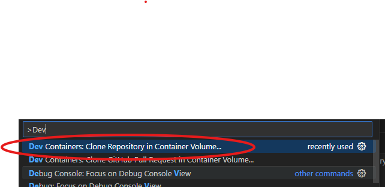
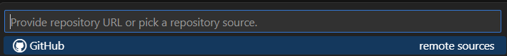

# Openstudio-Standards development using VSCode. 

These are instructions on how to conduct development in the openstudio-standards project, using development containers, and Visual Studio Code IDE. This method uses containers eliminate the need to install the correct version of ruby and other support tools required for development. It ensures that all developers are using the same consistent environment, same version of ruby and same toolchain. This help to avoid "It runs on my machine, but not yours" issues. The container is an Ubuntu linux based, and you can install linux console based applications if you wish. However, everything that you need for standards development is already included. 


## Requirements
### Docker
**Windows**: [Docker Desktop 2.0+](https://www.docker.com/products/docker-desktop/) on Windows 10 Pro/Enterprise. Windows 10 Home (2004+) requires Docker Desktop 2.3+ and the WSL 2 back-end. (Docker Toolbox is not supported. Windows container images are not supported.) Installation instructions are [here](https://docs.docker.com/desktop/install/windows-install/) ensure that your windows user account is part of the docker-group. Do not skip that step. 
**macOS**: [Docker Desktop 2.0+](https://www.docker.com/products/docker-desktop/).
**Linux**: Docker CE/EE 18.06+ and Docker Compose 1.21+. (The Ubuntu snap package is not supported.) Use your distros package manager to install.

Ensure that docker desktop is running on your system.  You should see it present in your windows task tray.  Then run the following command. 

```
docker run hello-world
```

You should see the following output.

```
Unable to find image 'hello-world:latest' locally
latest: Pulling from library/hello-world
c1ec31eb5944: Pull complete
Digest: sha256:d000bc569937abbe195e20322a0bde6b2922d805332fd6d8a68b19f524b7d21d
Status: Downloaded newer image for hello-world:latest

Hello from Docker!
This message shows that your installation appears to be working correctly.

To generate this message, Docker took the following steps:
 1. The Docker client contacted the Docker daemon.
 2. The Docker daemon pulled the "hello-world" image from the Docker Hub.
    (amd64)
 3. The Docker daemon created a new container from that image which runs the
    executable that produces the output you are currently reading.
 4. The Docker daemon streamed that output to the Docker client, which sent it
    to your terminal.

To try something more ambitious, you can run an Ubuntu container with:
 $ docker run -it ubuntu bash

Share images, automate workflows, and more with a free Docker ID:
 https://hub.docker.com/

For more examples and ideas, visit:
 https://docs.docker.com/get-started/
```

### Visual Studio Code
[Visual Studio Code](https://code.visualstudio.com/) is an free to use editor that has a variety of publically created plug-ins. Some even support OpenStudio and EnergyPlus development. Click on the link above and install in on your computer. 
## Configuration
1. Launch vscode and install the following extenstions. 
    * [Remote-Containers](https://marketplace.visualstudio.com/items?itemName=ms-vscode-remote.remote-containers)
    * [Remote-Containers-Extention-Pack](https://marketplace.visualstudio.com/items?itemName=ms-vscode-remote.vscode-remote-extensionpack)

## Development Workflow

### Clone Standard Repository into a DevContainer
This will create a container workspace and clone all the source code for openstudio-standards required for development.  
1. Hit Ctrl+Shift+P to bring up the command pallet on the top of vscode. 
1. Start to type "Dev Containers" and select " Dev Containers: Clone Repository in Container Volume" 
1. Enter the URL for the openstudio-standards repository.  For the nrcan branch use:
`` https://github.com/NREL/openstudio-standards/tree/nrcan ``
1. Wait a few minutes for the container to be created and to clone the source-code. 

### Bring up a terminal to execute commands. 
1. Hit Ctrl-Shift-`  (that is a backtick) to bring up a terminal. There are other ways to do this as well, such as the "Terminal Menu on the top or the "+" symbol to the right of the terminal on the bottom of vscode. You can now issue commands to the container.  

### Install Certificates (NRCan Only)
The NRCan network requires certificate to be installed in your container. Clone the cert repo. 
```sh
git clone https://github.com/canmet-energy/linux_nrcan_certs
```
Then install the certs by cut and pasting this command. This will also remove the cert folder as it will no longer be needed. 
```ssh 
cd linux_nrcan_certs && ./install_nrcan_certs.sh && cd .. && rm -fr linux_nrcan_certs
```

### Install / Update Ruby Gems. 
This will install all the ruby packages required by standards. 
1. In the terminal, enter:
``
bundle install --path vendor/bundle
``


You are now ready for development! You can change branches, commit, push and pull from git. You can run bundle command to test the code as well from the terminal.

## Run Development Tests
You want to ensure that ahead of a pull request that you run the battery of tests to ensure that you have not broken any of the existing functionality. To do this. Run the following command. 
```sh
bundle exec rake test:parallel_run_all_tests_locally
```

Depending on the speed of your computer this may take a few hours. Best practice is to run this overnight. 


## Tips / Tricks
### Copy files to/from host into your workspace folder. 

You can use the CTRL+C, CTRL-V to cut as paste to/from your host(windows) machine. 


## Debugging using integrated VSCode ruby debugger. 
You have to make some modification to the following to /workspaces/openstudio-standards/openstudio-standards.gemspec
```ruby
spec.add_development_dependency 'debug' 
```
update your installed gems by running this command in the terminal window
```
bundle install --path vendor/bundle
```
To debug, open the file in vscode editor window.. then hit F5. Ensure the file that appears on the top is what you want to run and hit Enter. 


