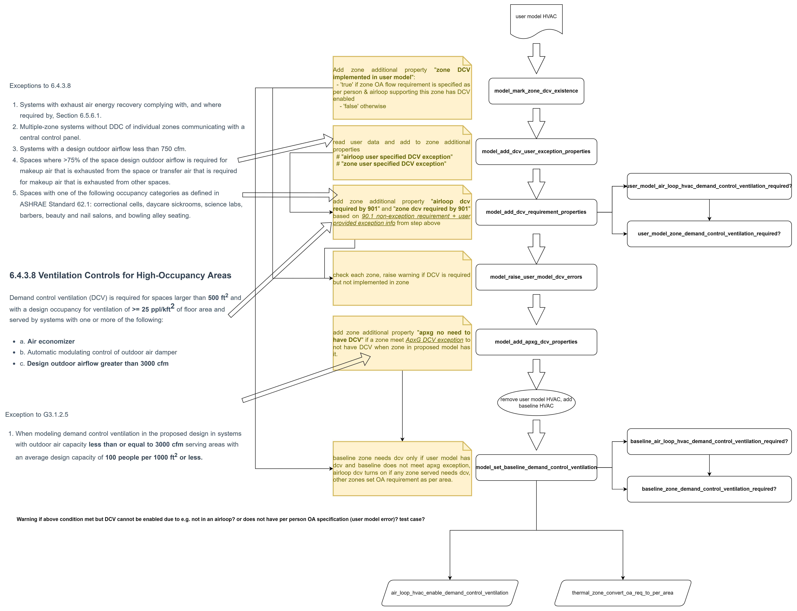

# DCV for Appendix G baseline generation

Xuechen (Jerry) Lei, PNNL
Update: 06/29/2022

## Code requirements

### 90.1-2019

#### 6.4.3.8 Ventilation Controls for High-Occupancy Areas

Demand control ventilation (DCV) is required for spaces larger than 500 ft2 and with a design occupancy for ventilation of >= 25 ppl/kft2 of floor area and served by systems with one or more of the following:

- a. Air economizer
- b. Automatic modulating control of outdoor air damper
- c. **Design outdoor airflow greater than 3000 cfm**

Exceptions to 6.4.3.8

1. Systems with exhaust air energy recovery complying with, and where required by, Section 6.5.6.1.
2. Multiple-zone systems without DDC of individual zones communicating with a central control panel.
3. **Systems with a design outdoor airflow less than 750 cfm.**
4. Spaces where >75% of the space design outdoor airflow is required for makeup air that is exhausted from the space or transfer air that is required for makeup air that is exhausted from other spaces.
5. Spaces with one of the following occupancy categories as defined in ASHRAE Standard 62.1: correctional cells, daycare sickrooms, science labs, barbers, beauty and nail salons, and bowling alley seating.

**Note that in most cases, such systems will always have economizer. As a result, the deciding conditions for DCV mandate are mostly: 1. > 500 ft2; 2. >= 25 ppl/kft2; and 3. design outdoor airflow > 750 cfm.**

#### G3.1.2.5 Ventilation

Minimum ventilation system outdoor air intake flow shall be the same for the proposed design and baseline building design.

Exception to G3.1.2.5

1. When modeling demand control ventilation in the proposed design in systems with outdoor air capacity less than or equal to 3000 cfm serving areas with an average design capacity of **100 people per 1000 ft2 or less.**
2. ...

**We checked with 90.1 committee that in this exception, the relationship between the two conditions should be "or".**

### PRM-RM

#### 3.5.5.4 Minimum Outdoor Air Ventilation Rate

|               |                                                                                                                                                                   |
| ------------- | ----------------------------------------------------------------------------------------------------------------------------------------------------------------- |
| Applicability | All HVAC zones                                                                                                                                                    |
| Definition    | The minimum quantity of outdoor ventilation air that must be provided to the space when it is occupied                                                            |
| Units         | cfm or cfm/ft²                                                                                                                                                    |
| Input         | Restrictions As designed                                                                                                                                          |
| Baseline      | Building Minimum ventilation system outdoor air intake flow shall be the same for the proposed and baseline building designs. Except in the following conditions: |

- Demand control ventilation shall not be modeled in zones served by systems with outdoor air less than 3000 cfm **and** occupant density of 100 people per 1000 ft2 or less.
- ...

**According to the clarification in previous section, the 'and' in above exception should also be 'or'.**

## Code requirements interpretation

The high level idea behind Appendix G DCV requirements is: if DCV is not required per 90.1 Section 6.4.3.8, but the proposed model has it, then Appendix G wants to credit the DCV-introduced energy saving by removing DCV in the baseline model.

If the space has conditions such as a high occupancy density (>= 25 ppl/kft2) and high design outdoor airflow (>= 3000 cfm), then according to 90.1 6.4.3.8, DCV is mandatory. In this case (i.e. DCV is mandatory according to 90.1 6.4.3.8), Appendix G baseline and proposed model should both have DCV. As a result, energy savings caused by DCV is not credited for Appendix G. One thing to note is, "both having DCV" is based on exception 1, however, the conditions specified for high occupancy density (>= 100 ppl/kft2) in this exception is different from 90.1 6.4.3.8 (>= 25 ppl/kft2), and other conditions used to unsatisfy this exception (outdoor air less than 3000 cfm or occupant density of 100 people per 1000 ft2 or less) is different from the conditions to require mandatory DCV in 90.1 6.4.3.8. As a result, there may be a case where DCV is mandatory per 90.1, but Exception 1 of Appendix G 3.1.2.5 is not met. For instance, when design OA flow is 3500 cfm and occupant density is 50 ppl/kft2, DCV is mandatory according to 90.1 6.4.3.8, while according to PRM-RM, DCV shall not be modeled.

If the space is not required to have DCV according to 90.1 6.4.3.8, but the proposed model has DCV, then we would like to credit the energy savings of DCV for the proposed model under appendix G. To make this happen, we would delete the DCV in the baseline model. The condition difference in the above bullet also has impact here. For instance, due to satisfying exception of 90.1 6.4.3.8, DCV is not required, and in the meantime, because of a large design OA flow of 4000 cfm, exception 1 of Appendix G 3.1.2.5 is not met, so baseline and proposed model need to have the same ventilation OA flow. In such a case, whether DCV is implemented in the proposed model or not, we will keep baseline the same (do nothing for baseline). If DCV is mandatory but not implemented in the proposed model, an error will be raised.

For the five exceptions of 90.1 6.4.3.8, we will not implement the checking of them under Appendix G. Instead, we will ask the user to provide such information of if the model meets any exception for not having mandatory DCV.

## Implementation design summary diagram

